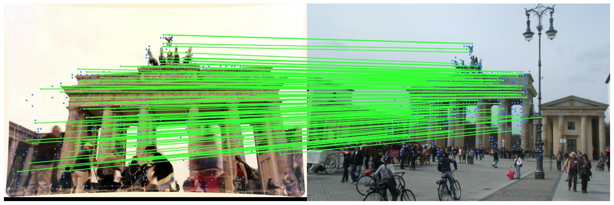

# Dockerize Deep learning model

The objectibe of this repository is to give overview of deplyoing a pretrained deep learning computer vison model by dockerizing it, which is based on kornia framework which matches the given two image. 

[Kornia](https://kornia.readthedocs.io/en/latest/) is a computer vision framework built on top of pytorch 

The pretrained model which has been used is [kornia implementation](https://kornia.readthedocs.io/en/latest/applications/image_matching.html) of LoFTR: Detector-Free Local Feature Matching with Transformers. LoFTR can extract high-quality semi-dense matches even in indistinctive regions with low-textures, motion blur, or repetitive patterns. 



## To-Do
1. Install [Docker](https://docs.docker.com/engine/install/) as per your operating system. Ignore this part if you already have it.
2. Clone this repository by running ```git clone https://github.com/Deshram/dockerize-image-matching-model```
3. Make a ```models``` folder and download weights from below links
4. Here I've used [outdoor](http://cmp.felk.cvut.cz/~mishkdmy/models/loftr_outdoor.ckpt) weights, but you can also try [indoor](http://cmp.felk.cvut.cz/~mishkdmy/models/loftr_indoor.ckpt) and [indoor new](http://cmp.felk.cvut.cz/~mishkdmy/models/loftr_indoor_ds_new.ckpt) weights which are trained on different dataset by downloading them in ```models``` folder 
5. Build docker image by running ```docker build -t IMAGE_NAME .``` e.g. ```docker build -t image_mathcing .```
6. Run docker container to deploy on host ```docker run --gpus all -p HOST_PORT:CONTAINER_PORT IMAGE_NAME``` e.g. ```docker run --gpus all -p 5000:5000 image_matching```
PS: Use ```--gpus all``` if host machine contains GPU 


https://github.com/Deshram/dockerize-image-matching-model/assets/43752639/e79c1931-794f-44ee-8cf5-ca00cf5b6fb3

